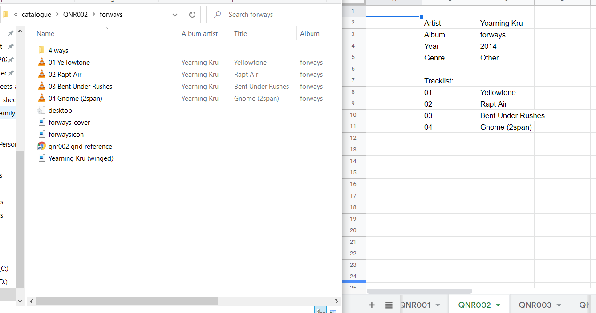

# id3 Album Sheet Maker
### Archive album and track data on Google Sheets from id3 tags

This is a tool to read a directory of folders of mp3 albums and write each album data to a seperate info sheet of a Google Spreadsheet.



it primarily uses:
- [node id3](https://github.com/Zazama/node-id3) 
- [Google Sheets API](https://developers.google.com/sheets/api/guides/concepts)

## Settup and Installation
- run npm install
- create a .env file following the format layed out in example.env
- This script uses Google Sheets OAuth 2.0 token for verification. A google developer profile and access can be created by following here:
https://developers.google.com/sheets/api/guides/authorizing#AboutAuthorization
- After this is settup, the credentials.json file will need to be included in the folder and linked to in the .env file, as well as the API key, the id of the sheet you want to write to, and the root directory containing the mp3s.
- Make sure your mp3 album folder structure matches the following:
```sh
Root Directory
    - Release / Album Folder
        - Track Folder
            - mp3s
            OR
            - Track Subfolders (in the case of double albums)
                - mp3s
```
This structure is based on my personal collection. To change this, see **Configuration**.

## Running the script

in the terminal, run ``node index.js``
The first time this is run, you will need to authorise, Copy the link that appears in the terminal to your browser and authorise with your Google account, and copy and paste the resulting code back into the terminal. After the first time this will create a token for future use.

## Configuration
This script has been designed to specifically upload my collection of mp3s in the format I wanted. However, it has been seperated into modules to allow for configuration to fit other uses.
#### File Structure
`getNestedmp3s.js` contains code determing how far nested the mp3s are, and conditions for different levels of nesting (in my case, double albums that contained sub-folders of mp3s, whcih i chose to flatten into one).
#### id3 Tags
`id3TagConfig.js` configures, from the node-id3 package, what tages to retrieve or ignore.
#### Sheet Formatting
`getSheetConfig.js` has options to configure the request object that defines the sheet itself (such as tab colour) based on Google Sheets API.
#### Cell Formatting
`getWriteCellsConfig.js` is where you can define the way the tags are written to specific cells, their orientation and position.

With some adaptation this repo could be a useful starting point for mor sheets-based tasks, ie reading from sheets, so hope its useful, and enjoy! 